<div align="center">


<a href="https://git.io/typing-svg">
  
</a>

<br/>

<a href="https://www.linkedin.com/in/revan-rao-kokkirala/" target="_blank">
  
</a>
&nbsp;
<a href="https://huggingface.co/RevanRaoK" target="_blank">
  
</a>
&nbsp;
<a href="https://www.kaggle.com/revankokkirala" target="_blank">
  
</a>
&nbsp;
<a href="https://github.com/RevanRaoK" target="_blank">
  
</a>

<br/><br/>


</div>

---

## 🧠 About Me

```python
class RevanRao:
    role        = ["Backend Engineer", "AI Engineer"]
    university  = "KMIT Hyderabad — B.Tech CSE/AIML (2027)"
    location    = "Hyderabad, India 🇮🇳"
    languages   = ["Python", "Java", "C++", "JavaScript", "Node.js"]
    focus       = ["Agentic AI Systems", "Backend APIs", "LLM Optimization"]
    currently   = "Building intelligent systems & prepping for placements"
    fun_fact    = "I debug at 2AM and call it productivity 🌙"
```

---

## 🚀 Featured Projects

<table>
  <tr>
    <td width="50%">
      <h3>🤖 <a href="https://github.com/RevanRaoK/CodeNova">CodeNova</a></h3>
      <p>An AI-powered competitive programming assistant that analyzes problems, generates optimized solutions, and explains approaches step-by-step using LLMs.</p>
      <p>
        
        
        
      </p>
    </td>
    <td width="50%">
      <h3>📄 <a href="https://github.com/RevanRaoK/Smart-Resume">Smart-Resume</a></h3>
      <p>An intelligent resume builder that tailors your resume to job descriptions using NLP — generates ATS-friendly content and scores resume-job fit.</p>
      <p>
        
        
        
      </p>
    </td>
  </tr>
</table>

---

## 🛠️ Tech Stack

<div align="center">

**Languages**


**AI / ML**


**Backend & Tools**


</div>

---

## 📊 GitHub Stats

<div align="center">

<!-- Stats & Languages — generated by GitHub Actions into /profile/ folder -->

&nbsp;&nbsp;


</div>

<div align="center">

<!-- Streak Stats — demolab is actively maintained and reliable -->
<a href="https://git.io/streak-stats"></a>

<!-- Fallback if demolab is down — swap the src above with: -->
<!-- https://github-readme-streak-stats-eight.vercel.app?user=RevanRaoK&theme=gruvbox&hide_border=true&border_radius=12&ring=C0602A&fire=D4782A&currStreakLabel=6B7C3A -->

</div>

<div align="center">

<!-- Metrics card — generated by GitHub Actions into /profile/ folder -->


</div>

---

## 🐍 Contribution Graph

<div align="center">

<picture>
  <source media="(prefers-color-scheme: dark)" srcset="https://raw.githubusercontent.com/RevanRaoK/RevanRaoK/output/github-snake-dark.svg" />
  <source media="(prefers-color-scheme: light)" srcset="https://raw.githubusercontent.com/RevanRaoK/RevanRaoK/output/github-snake.svg" />
  
</picture>

</div>

---

<div align="center">


*"Code is not just logic — it's craft."*

</div>
